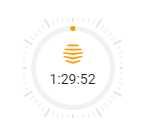

```markdown
# Mushroom Circle Timer Card

A customizable circular progress card with Mushroom design compatibility for Home Assistant.



## Features
- Progress indicator starting at 12 o'clock
- Clockwise and counter-clockwise options 
- Color conditions based on time/percentage
- Compatible with grid layout
- Customizable tick marks
- Timer countdown display
- Theme-aware styling

## Installation
1. Install via HACS custom repository
2. Add reference to dashboards configuration:
```yaml
resources:
  - url: /hacsfiles/mushroom-circle-card/mushroom-circle-card.js
    type: module
```

## Configuration Options
| Option | Type | Default | Description |
|--|--|--|--|
| type | string | required | `custom:mushroom-circle-card` |
| entity | string | required | Entity ID |
| name | string | Entity name | Card name |
| icon | string | `mdi:circle` | Icon to display |
| show_ticks | boolean | `false` | Show tick marks |
| tick_position | string | `inside` | `inside` or `outside` |
| direction | string | `counter-clockwise` | `clockwise` or `counter-clockwise` |
| stroke_width | number | `8` | Width of progress ring |
| hide_name | boolean | `false` | Hide entity name |
| display_mode | string | `both` | `both`, `icon`, or `state` |
| icon_size | string | `24px` | Size of icon |
| layout | object | `{}` | Layout configuration |
| layout.width | number | `1` | Width in grid units (50px) |
| layout.height | number | `1` | Height in grid units (50px) |
| guess_mode | boolean | `false` | Use countdown estimation |
| ring_color | string | - | Conditional color expression |

## Usage Examples

### Basic Timer
```yaml
type: custom:mushroom-circle-card
entity: timer.thermostat_boost
icon: phu:hive
direction: counter-clockwise
guess_mode: true
```

### Styled Timer with Color Conditions
```yaml
type: custom:mushroom-circle-card
entity: timer.thermostat_boost
icon: phu:hive
show_ticks: true
tick_position: outside
direction: counter-clockwise
guess_mode: true
layout:
  width: 4
  height: 4
ring_color: >
  remaining <= (3 * 60) ? 'red' :     # Last 3 minutes
  remaining <= (5 * 60) ? 'orange' :   # Last 5 minutes
  remaining <= (10 * 60) ? 'yellow' :  # Last 10 minutes
  'green'
stroke_width: 8
```

### Battery Level Display
```yaml
type: custom:mushroom-circle-card
entity: sensor.battery_level
icon: mdi:battery
direction: clockwise
show_ticks: true
ring_color: >
  percentage <= 20 ? 'red' :
  percentage <= 50 ? 'orange' : 
  'green'
```

### Grid Layout with Custom Size
```yaml
type: custom:mushroom-circle-card
entity: timer.washer
icon: mdi:washing-machine
direction: clockwise
layout:
  width: 2
  height: 2
show_ticks: true
tick_position: outside
```

## Conditions
Color conditions can be based on:
- `remaining`: Time in seconds
- `percentage`: Progress percentage
- `value`: Raw entity value
- `state`: Entity state

## Support
Open an issue on GitHub for support.
```
